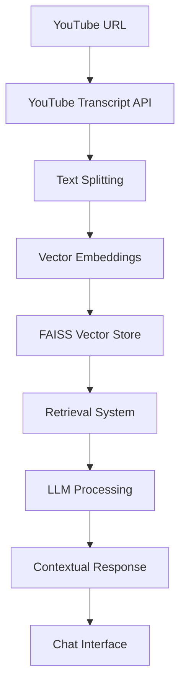

# 🎥 VideoNami - YouTube Video Chatbot

[](https://your-app-url.streamlit.app)
[](https://www.python.org/downloads/)
[](https://opensource.org/licenses/MIT)

**VideoNami** is an intelligent YouTube video chatbot that allows you to have natural conversations with any YouTube video content. Simply paste a YouTube URL, and start asking questions about the video - powered by advanced AI models and semantic search.

![VideoNami Demo] https://github.com/user-attachments/assets/9898b68c-f88a-4eec-b2e3-514f32bad241

## ✨ Features

### 🎯 **Smart Video Analysis**
- **Automatic transcript extraction** from YouTube videos
- **Intelligent text chunking** for optimal processing
- **Vector-based semantic search** using FAISS
- **Context-aware responses** based on video content

### 💬 **Natural Conversation**
- **Chat interface** similar to ChatGPT
- **Contextual understanding** of video content
- **Conversation history** tracking
- **Sample questions** to get you started

### 📱 **Fully Responsive Design**
- **Mobile-first** approach with touch-optimized UI
- **Tablet and desktop** optimized layouts
- **Progressive enhancement** for all screen sizes
- **Modern, intuitive** interface design

### ⚡ **Powered by Advanced AI**
- **Meta Llama 3.1 8B** language model
- **Sentence Transformers** for embeddings
- **LangChain** for RAG pipeline
- **HuggingFace** model integration

## 🚀 Quick Start

### Prerequisites
- Python 3.8 or higher
- HuggingFace API key
- Git

### Installation

1. **Clone the repository**
   ```bash
   git clone https://github.com/yourusername/videonami.git
   cd videonami
   ```

2. **Install dependencies**
   ```bash
   pip install -r requirements.txt
   ```

3. **Set up environment variables**
   ```bash
   # Create .env file
   echo "HUGGINGFACEHUB_API_TOKEN=your_huggingface_api_key" > .env
   ```

4. **Add your logo** (optional)
   ```bash
   # Place your logo file as my_logo.png in the root directory
   cp your_logo.png my_logo.png
   ```

5. **Run the application**
   ```bash
   streamlit run app.py
   ```

## 📖 How to Use

### Step 1: Process a Video
1. **Paste any YouTube URL** in the sidebar
2. **Click "Process Video"** to extract and analyze the transcript
3. **Wait for processing** to complete (usually 30-60 seconds)

### Step 2: Start Chatting
1. **Ask questions** about the video content
2. **Get intelligent responses** based on the transcript
3. **Continue the conversation** naturally

### Example Questions:
- "What is this video about?"
- "Can you summarize the main points?"
- "What does the speaker say about [specific topic]?"
- "What are the key takeaways?"
- "Who is the target audience for this video?"

## 🛠️ Technical Architecture



### Core Components:
- **Frontend**: Streamlit with responsive CSS
- **Video Processing**: YouTube Transcript API
- **Text Processing**: LangChain RecursiveCharacterTextSplitter
- **Vector Store**: FAISS for semantic search
- **Embeddings**: Sentence Transformers (all-MiniLM-L6-v2)
- **LLM**: Meta Llama 3.1 8B via HuggingFace
- **RAG Pipeline**: LangChain LCEL

## 📁 Project Structure

```
videonami/
├── app.py                 # Main Streamlit application
├── youtube_utils.py       # YouTube URL processing utilities
├── requirements.txt       # Python dependencies
├── .env                   # Environment variables (create this)
├── my_logo.png           # Your logo file (optional)
├── README.md             # This file
└── assets/               # Additional assets
    └── demo.gif          # Demo GIF
```

## 📦 Dependencies

```python
streamlit >= 1.28.0
langchain >= 0.1.0
langchain-huggingface >= 0.0.3
langchain-community >= 0.0.20
youtube-transcript-api >= 0.6.0
faiss-cpu >= 1.7.4
python-dotenv >= 1.0.0
sentence-transformers >= 2.2.2
torch >= 2.0.0
```

## 🎨 Responsive Design

VideoNami is built with a mobile-first approach:

### 📱 Mobile (≤768px)
- Single-column layout
- Touch-optimized buttons
- Full-width inputs
- Stacked sample questions

### 📟 Tablet (769px-1024px)  
- Balanced multi-column layout
- Medium-sized touch targets
- Optimized sidebar

### 💻 Desktop (≥1025px)
- Full multi-column experience
- Rich visual hierarchy
- Maximum content density

## 🔧 Configuration

### Environment Variables
Create a `.env` file in the root directory:

```env
# Required
HUGGINGFACEHUB_API_TOKEN=your_huggingface_api_key

# Optional
HUGGINGFACEHUB_API_URL=https://api-inference.huggingface.co/models/
```

### Customization Options
- **Logo**: Replace `my_logo.png` with your own logo
- **Colors**: Modify CSS in `app.py` for custom theming
- **Models**: Change model names in `initialize_models()` function
- **Chunk Size**: Adjust `chunk_size` in `RecursiveCharacterTextSplitter`

## 🚧 Limitations

- **English subtitles only**: Requires videos with English captions
- **Public videos**: Works only with publicly accessible YouTube videos
- **Processing time**: Initial processing takes 30-60 seconds per video
- **Context window**: Limited by model's context length

## 🤝 Contributing

We welcome contributions! Here's how you can help:

1. **Fork the repository**
2. **Create a feature branch** (`git checkout -b feature/amazing-feature`)
3. **Commit your changes** (`git commit -m 'Add amazing feature'`)
4. **Push to the branch** (`git push origin feature/amazing-feature`)
5. **Open a Pull Request**

### Areas for Contribution:
- 🌍 Multi-language support
- 🎨 UI/UX improvements
- ⚡ Performance optimizations
- 🔧 Additional model integrations
- 📚 Documentation improvements


## 🙏 Acknowledgments

- **[LangChain](https://langchain.com/)** - For the excellent RAG framework
- **[HuggingFace](https://huggingface.co/)** - For model hosting and APIs
- **[Streamlit](https://streamlit.io/)** - For the amazing web app framework
- **[YouTube Transcript API](https://github.com/jdepoix/youtube-transcript-api)** - For transcript extraction
- **[FAISS](https://github.com/facebookresearch/faiss)** - For efficient similarity search


**Made with ❤️ by Lovepreet Singh(https://github.com/Love-Sandhu315)**

*If you find VideoNami useful, please consider giving it a ⭐!*
